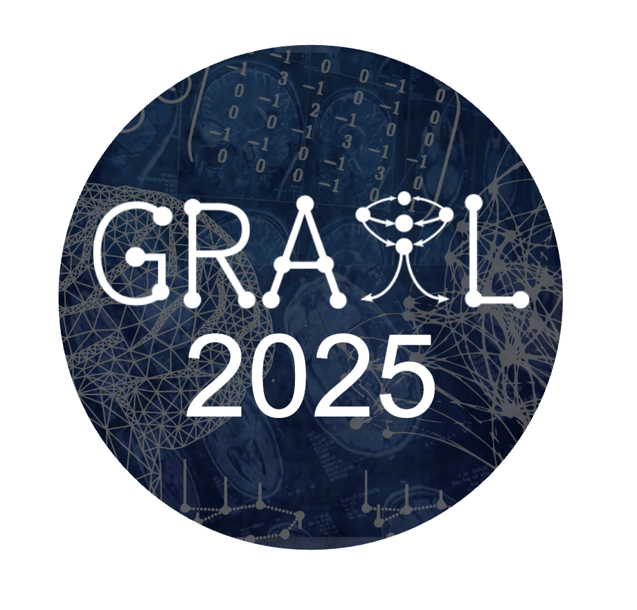
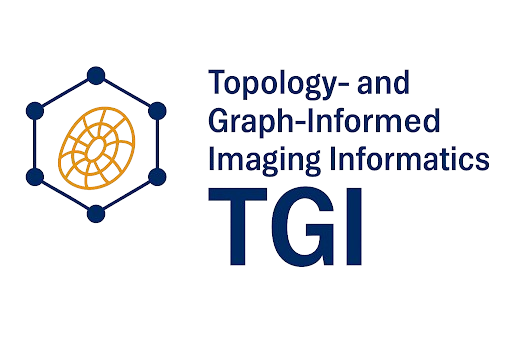

<h3>Tracks</h3>

  <a href="https://grail-miccai.github.io/" target="_blank" style="text-decoration: none !important; border: none;">
    
    
GRAIL

  </a>

  <a href="https://topology-miccai.github.io/TGI_2025.html" target="_blank" style="text-decoration: none !important; border: none;">
    
    
TGI

  </a>

  <a href="https://www.gaoyue.org/activity/MICCAI%202025%20Workshop%20Track:%20Hypergraph%20Computation%20for%20Medical%20Image%20Analysis" target="_blank" style="text-decoration: none !important; border: none;">
    
    
Hypergraph

  </a>

<h1 style="text-align: center;">Important Dates</h1>

|     Event      |                           Date                           |
|:-------------:|:---------------------------------------------------------:|
| Submission Opening          | May 16th, 2025  |
| Full Paper Deadline          | <strong>July 16th, 2025; 11:59 PM PST</strong> |
| Reviews Due | July 30th, 2025; 11:59 PM PST |
| Notification of Acceptance   | August 4th, 2025; 11:59 PM PST |
| Camera-ready Due | August 11th, 2025; 11:59 PM PST |
| Workshop Proceedings Due | August 15th, 2025; 11:59 PM PST |
| Workshop Date       | September 27th, 2025 (MICCAI 2025 Satellite Events Day 2)|

<h1 style="text-align: center;">Submission Guidelines</h1>

- <strong>(Update)</strong> Keynote: We are happy to have <a href="https://bispl.weebly.com/professor.html">Prof. Jong Chul Ye </a> as our keynote speaker. 
- Papers: Full papers (max 8 pages text + max 2 pages references, supplemental material allowed) formatted in <a href="https://www.springer.com/gp/computer-science/lncs/conference-proceedings-guidelines">LNCS style</a> (Template: <a href="https://www.overleaf.com/latex/templates/springer-lecture-notes-in-computer-science/kzwwpvhwnvfj">Overleaf</a>).
- Submission Portal: <a href="https://cmt3.research.microsoft.com/GRAIL2025/Submission/index"> https://cmt3.research.microsoft.com/GRAIL2025.
- Review: The review is double-blind. Reviewers will be chosen among experts in the medical image computing community.
- Proceedings: Our workshop will be submission-based and we would like to publish the accepted papers as a part of the MICCAI Satellite Events joint LNCS proceedings.

<h1 style="text-align: center;">Contact</h1>
Feel free to email Xiaoling Hu (<a href="mailto:xihu3@mgh.harvard.edu">xihu3@mgh.harvard.edu</a>) or Chao Chen (<a href="mailto:chao.chen.1@stonybrook.edu">chao.chen.1@stonybrook.edu</a>) if you have any questions regarding the workshop.

<h1 style="text-align: center;">GRaphs in biomedicAl Image anaLysis (GRAIL)</h1>

  This year <em>Topology- and Graph-Informed Imaging Informatics (TGI)</em> is a special track of <b><a href="https://grail-miccai.github.io/">GRAIL 2025</a></b>, which is the seventh international <b>Workshop on GRaphs in biomedicAl Image anaLysis</b>,
  organized as an in-person satellite event of MICCAI 2025 in Daejeon, Korea.
    
  This year, GRAIL returns as a dynamic full-day workshop, also featuring three specialized tracks: 
  (1) <a href="https://grail-miccai.github.io/">Graphs in Biomedical Image Analysis</a>, and 
  (2) <a href="https://topology-miccai.github.io/TGI_2025.html" target="_blank">Topology- and Imaging-Informed Graph Informatics (TGI)</a>, and 
  (3) <a href="https://www.gaoyue.org/activity/MICCAI%202025%20Workshop%20Track:%20Hypergraph%20Computation%20for%20Medical%20Image%20Analysis" target="_blank">Hypergraph Computation for Medical Image Analysis</a>.
  These focused sessions will spotlight the latest advancements in graph-based AI for medical imaging, 
  bringing together leading researchers and innovators for a day of cutting-edge insights and collaboration.

<h1 style="text-align: center;">Call For Submissions</h1>

The significant advances in computational and data science over the past decade have had an immense impact on biomedical science and healthcare. Concurrently, researchers in the biomedical fields now face new challenges caused mainly by the nature of complex, often high-dimensional, noisy, and diverse datasets.

Recent years have witnessed an increasing interest in the role topology plays in machine learning and data science. Topology offers a collection of techniques that have matured into a field known as **Topological Data Analysis (TDA)**. TDA provides a robust set of general-purpose tools that have demonstrated strong performance in numerous real-world applications. These tools are naturally applicable to various data types including:

- Images  
- Point clouds  
- Graphs and meshes  
- Time-varying data  

TDA techniques are increasingly being integrated with deep learning to improve performance, expressiveness, and generalizability. Their robustness allows for the discovery of complex relationships and extraction of persistent features across multiple scales, even in noisy environments. Moreover, TDA naturally supports **interpretability and visualization**, helping to build trust in AI systems among medical professionals.

All these qualities strongly motivate the use of TDA in areas such as **neuroscience, bioscience, biomedicine**, and **medical imaging**.

---

### Workshop Scope

This workshop focuses on leveraging TDA to enhance the **performance, generalizability, expressiveness, efficiency**, and **explainability** of modern medical data analysis methods. Specifically, it emphasizes TDA alone or in combination with other computational techniques (e.g., deep learning, feature engineering) across modalities like:

- Medical images and videos  
- Sound and physiological signals  
- Text and sequential data  

The workshop aims to foster collaboration among **mathematicians, biomedical engineers, computer scientists, statisticians,** and **medical professionals**, encouraging knowledge exchange and showcasing the value of TDA in medical data analysis.

---

### Topics of Interest

We welcome submissions exploring the use of TDA—alone or combined with other computational techniques—in solving problems in medical computing and computer-assisted intervention. Topics include but are not limited to:

1. Ensemble methods combining topology and deep learning  
2. Topological approaches for disease diagnosis, monitoring, and prediction  
3. TDA-based classification and segmentation (e.g., level sets, graph cuts)  
4. Topological techniques for medical signal processing (e.g., image, audio, text)  
5. Personalized medicine using TDA  
6. Shape modeling and analysis for medical data  
7. Optimization and learning strategies grounded in topology  
8. TDA for data registration, summarization, and enhancement  
9. Visualization, interpretability, and explainability of medical data  
10. Scalable TDA methods for electronic health records  
11. Topological structures in biomedical data analysis  

---

We look forward to your contributions to this interdisciplinary and impactful workshop!

## Organizing Committee

### Track Chairs:
- <a href="https://chaochen.github.io/index.html">**Chao Chen**</a>, Stony Brook University, USA  
- <a href="https://huxiaoling.github.io/">**Xiaoling Hu**</a>, Harvard Medical School, USA

### Co-Chairs:
- <a href="https://pages.stat.wisc.edu/~mchung/">**Moo K. Chung**</a>, University of Wisconsin-Madison, USA
- <a href="https://vivo.weill.cornell.edu/display/cwid-jop4027">**Johannes C. Paetzold**</a>, Weill Cornell Medicine, USA
- <a href="https://www.cs.unc.edu/~styner/">**Martin Andreas Styner**</a>, University of North Carolina at Chapel Hill, USA  
- <a href="https://engineering.virginia.edu/faculty/tom-fletcher">**Tom Fletcher**</a>, University of Virginia, USA  
- <a href="https://sites.google.com/view/jaehunjung/home">**Jae-Hun Jung**</a>, Pohang University of Science and Technology, Republic of Korea
- <a href="https://anujsrivastava.com/">**Anuj Srivastava**</a>, Florida State University, USA  
- <a href="https://sites.google.com/view/anqi-qui/home?authuser=0">**Anqi Qiu**</a>, Hong Kong Polytechnic University, Hong Kong SAR
- <a href="https://shape.postech.ac.kr/ilwoolyu/">**Ilwoo Lyu**</a>, Pohang University of Science and Technology, Republic of Korea
